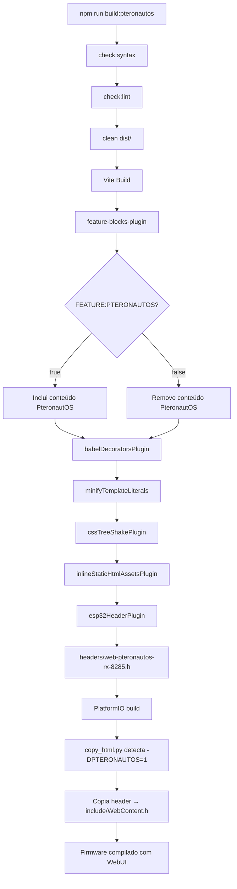
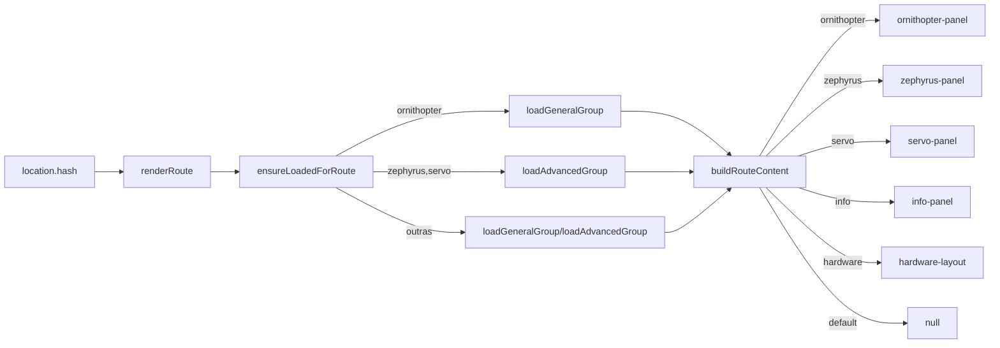

# PTERONAUTOS WEBUI — Magnum Opus Documentation

> *Firmware para ornitóptero biomecânico com servo-asa batente*
> *Documentatio — Inscrição Final do Magnum Opus*

---

## Índice

1. [Visão Geral da Arquitectura](#1-visão-geral-da-arquitectura)
2. [Sistema de Feature Gates](#2-sistema-de-feature-gates)
3. [Especificação dos Painéis](#3-especificação-dos-painéis)
4. [Sistema de Temas CSS](#4-sistema-de-temas-css)
5. [Pipeline de Build](#5-pipeline-de-build)
6. [Integração Firmware](#6-integração-firmware)
7. [Guia de Deploy](#7-guia-de-deploy)
8. [Resolução de Problemas](#8-resolução-de-problemas)
9. [Referência de Ficheiros](#9-referência-de-ficheiros)

---

## 1. Visão Geral da Arquitectura

### Diagrama de Componentes

```
┌─────────────────────────────────────────────────────────────────┐
│  index.html                                                      │
│  ├── elrs.css (ELRS base)                                        │
│  ├── pteronautos.css (fossil theme overlay, FEATURE-gated)       │
│  ├── main.css, icons.css, mui.css                                │
│  └── <elrs-app>                                                  │
│       ├── <header> product_name + version (auto from firmware)   │
│       ├── <div#sidedrawer>                                       │
│       │    ├── PteronautOS brand: pterosaur SVG + "PTERONAUT OS" │
│       │    ├── General: ...Ornithopter (FEATURE:PTERONAUTOS)     │
│       │    └── Advanced: ...Zephyrus, Servo (FEATURE:PTERONAUTOS)│
│       ├── <div#main>                                             │
│       │    └── Route-rendered panels (LitElement custom elements)│
│       └── <elrs-footer>                                          │
│            ├── Pterosaur ASCII art (FEATURE:PTERONAUTOS)         │
│            └── "ExpressLRS" fallback (FEATURE:NOT PTERONAUTOS)   │
└─────────────────────────────────────────────────────────────────┘
```

### Stack Tecnológica

| Camada | Tecnologia | Versão |
|--------|-----------|--------|
| Framework UI | Lit (lit-html) | 3.3.2 |
| Gestão de Estado | @lit-app/state | 1.0.0 |
| Bundler | Vite | 8.0.8 |
| Decorators | Babel (plugin-proposal-decorators) | 7.29.0 |
| CSS Framework | MUI (custom fork) | incluído |
| Compressão | node-zopfli-es | 2.0.5 |
| Build Output | C header gzipped (esp32-header-plugin) | — |
| Node.js mínimo | 18+ (usa operador `??=`) | — |

### Padrões Arquitecturais

1. **LitElement sem Shadow DOM**: Todos os painéis usam `createRenderRoot() { return this }` — herdam estilos globais directamente.

2. **Estado Singleton**: `elrsState` (de `src/utils/state.js`) é o *single source of truth* — todos os painéis lêem `elrsState.settings`, `elrsState.options`, `elrsState.config`.

3. **Lazy Loading por Grupo**: Os painéis são agrupados em `general-group.js` e `advanced-group.js`, carregados dinamicamente via `import()` quando a rota é acedida.

4. **Hash Routing**: Navegação via `location.hash` (`#ornithopter`, `#zephyrus`, `#servo`, etc). O `renderRoute()` em `app.js` faz o dispatch.

5. **Feature Gating em Build-Time**: Todo o conteúdo PteronautOS é removido em builds ELRS standard — zero impacto em Flash/RAM.

---

## 2. Sistema de Feature Gates

### Mecanismo

O plugin `build-plugins/feature-blocks-plugin.js` processa marcadores no código fonte durante o build:

```
<!-- FEATURE:PTERONAUTOS -->       ← HTML: inclui bloco se VITE_FEATURE_PTERONAUTOS=true
// FEATURE:PTERONAUTOS             ← JS linha: inclui linha seguinte
/* FEATURE:PTERONAUTOS */          ← JS bloco: inclui bloco entre marcadores
<!-- /FEATURE:PTERONAUTOS -->      ← HTML: fecha bloco
// /FEATURE:PTERONAUTOS            ← JS: fecha bloco
/* /FEATURE:PTERONAUTOS */         ← JS: fecha bloco

<!-- FEATURE:NOT PTERONAUTOS -->   ← HTML: inclui APENAS se flag for false
// FEATURE:NOT PTERONAUTOS         ← JS: idem
```

### Flags de Build

```bash
VITE_FEATURE_PTERONAUTOS=true   # Activa todo o conteúdo PteronautOS
VITE_FEATURE_IS_TX=false        # RX apenas (PteronautOS é RX-only)
VITE_FEATURE_HAS_SX128X=true    # Rádio SX1280 2.4GHz
VITE_FEATURE_IS_8285=true       # ESP8285 MCU
```

### Inventário de Feature Gates (19 marcadores)

| Ficheiro | Marcadores | Conteúdo |
|----------|-----------|----------|
| `index.html` | 2 | pteronautos.css `<link>`, título da página |
| `app.js` | 6 | SVG pterosaur + título brand; Ornithopter/Zephyrus/Servo menu; 3 rotas; lazy-load groups |
| `elrs-footer.js` | 2 | ASCII art (PTERONAUTOS) + "ExpressLRS" (NOT PTERONAUTOS) |
| `info-panel.js` | 2 | Ornithopter Mode + Zephyrus Gyro rows |
| `hardware-schema.js` | 2 | I2C bus section para PWMP7 |
| `general-group.js` | 2 | ornithopter-panel import |
| `advanced-group.js` | 2 | zephyrus-panel + servo-panel imports |
| `ornithopter-panel.js` | 1 | JSDoc FEATURE marker |
| `zephyrus-panel.js` | 1 | JSDoc FEATURE marker |
| `servo-panel.js` | 1 | JSDoc FEATURE marker |

### Verificação de Sanidade

```bash
# Contar marcadores FEATURE:PTERONAUTOS em todos os ficheiros
grep -rn "FEATURE:PTERONAUTOS" src/html/src/ src/html/index.html src/html/features.js | wc -l
# Esperado: 19
```

---

## 3. Especificação dos Painéis

### 3.1 Ornithopter Panel (`ornithopter-panel.js`)

**Custom Element**: `<ornithopter-panel>`
**Grupo**: General
**Rota**: `#ornithopter`

**Parâmetros Display (decorativos)**:

| Controlo | Tipo | Range | Default | Descrição |
|----------|------|-------|---------|-----------|
| Waveform Type | `<select>` | Sine/Triangle/Trapezoid | Sinusoidal | Forma de onda do batimento |
| Flap Frequency | `<input range>` | 1-15 Hz | 5 Hz | Frequência de batimento alar |
| Left Wing Amplitude | `<input range>` | 0-100% | 80% | Amplitude da asa esquerda |
| Right Wing Amplitude | `<input range>` | 0-100% | 80% | Amplitude da asa direita |
| Crest Rudder Offset | `<input range>` | -100/+100 µs | 0 µs | Offset do servo do leme cefálico |
| Throttle→Frequency Map | Text | — | — | Descrição do mapeamento CH3→frequência |

**Indicador de Status**:
- `ORNITHOPTER ACTIVE` (verde) — link RC presente (detectado via `product_name` disponível)
- `RC LINK REQUIRED` (cinzento) — sem ligação ao rádio

**Estado Futuro**: Integração com firmware para leitura/escrita de parâmetros do mixer via CRSF.

### 3.2 Zephyrus Panel (`zephyrus-panel.js`)

**Custom Element**: `<zephyrus-panel>`
**Grupo**: Advanced
**Rota**: `#zephyrus`

**Secções**:

1. **Gyro Status**:
   - `MPU6050 DETECTED` (verde) — quando `elrsState.settings.zephyrus_attached !== false`
   - `GYRO DISABLED — Connect MPU6050` (vermelho) — quando não detectado
   - Tabela de specs: MPU6050 (GY-521), I2C GPIO5=SDA/GPIO2=SCL, 200Hz, Mahony AHRS
   - Diagrama de wiring (texto): VCC→3.3V, GND→GND, SCL→GPIO2, SDA→GPIO5

2. **Attitude Indicator** (CSS decorativo):
   - Disco 180×180px com gradiente `#1a3a5c→#8b6914` (céu→terra)
   - Linha de horizonte com −3° de roll (estática, placeholder)
   - Indicador central dourado `#d4a017`
   - Label: "Live attitude visualization — firmware telemetry required"

3. **Roll Axis PID**:
   - P: 0.30 (range 0-100), I: 0.05, D: 0.15, Max: 40%

4. **Yaw Axis PID**:
   - P: 0.25 (range 0-100), I: 0.03, D: 0.10, Max: 50%

5. **Calibrate Gyro** (botão disabled):
   - Placeholder para comando de calibração futura

### 3.3 Servo Panel (`servo-panel.js`)

**Custom Element**: `<servo-panel>`
**Grupo**: Advanced
**Rota**: `#servo`

**Tabela PWM — 5 Canais PWMP7**:

| CH | Nome | GPIO | Center | Min | Max | Failsafe |
|----|------|------|--------|-----|-----|----------|
| 1 | Left Wing | 0 | 1500µs | 1000µs | 2000µs | 1500µs |
| 2 | Right Wing | 1 | 1500µs | 1000µs | 2000µs | 1500µs |
| 3 | Crest Rudder | 3 | 1500µs | 1000µs | 2000µs | 1500µs |
| 4 | AUX 4 | 9 | 1500µs | 1000µs | 2000µs | 1500µs |
| 5 | AUX 5 | 10 | 1500µs | 1000µs | 2000µs | 1500µs |

**Failsafe Configuration**:
- Mode: Center (1500µs) / Hold Last / Custom Preset
- Delay: 1000ms (range 100-2000ms)

**Servo Test Sweep** (botão disabled): Placeholder para varrimento cíclico de todos os servos.

### 3.4 Info Panel (extensões PteronautOS)

Duas linhas adicionais na tabela de informações (FEATURE-gated):

| Campo | Fonte | Exemplo |
|-------|-------|---------|
| **Ornithopter Mode** | Hardcoded "Active" (decorativo) | `Active` |
| **Zephyrus Gyro** | `elrsState.settings.zephyrus_attached` | `Connected (MPU6050)` / `Not Detected` |

### 3.5 Hardware Schema (extensão PWMP7)

Secção I2C adicional (FEATURE-gated) no `hardware-schema.js`:

```javascript
{
    title: 'PteronautOS — I2C Bus (MPU6050 Gyro)',
    rows: [
        { id: 'i2c_scl', label: 'SCL pin', desc: 'GPIO2 on PWMP7 (connected to MPU6050 SCL)' },
        { id: 'i2c_sda', label: 'SDA pin', desc: 'GPIO5 on PWMP7 (connected to MPU6050 SDA)' },
    ]
}
```

---

## 4. Sistema de Temas CSS

### Paleta Fossil

| Elemento | Cor | Uso |
|----------|-----|-----|
| `#2a1f0a` | Castanho escuro | Background do header |
| `#b8860b` | Âmbar escuro (Dark Goldenrod) | Gradiente header, accent sliders |
| `#8b6914` | Bronze | Gradiente intermédio, botões primary |
| `#5c3d0e` | Castanho fossilizado | Gradiente final, footer |
| `#d4a017` | Ouro pálido | Links, brand, texto título, horizonte |
| `#1a1a1a` | Carvão | Background do body |
| `#222` | Cinza escuro | Sidedrawer |
| `#2a2a2a` | Cinza médio | Panels (cards) |
| `#333` | Cinza input | Inputs, selects, textareas |
| `#444` | Cinza border | Borders, dividers |
| `#ccc` | Cinza claro | Texto principal |

### Hierarquia de Overrides

```
elrs.css (base ELRS) → pteronautos.css (overrides !important) → estilo inline dos painéis
```

Todas as regras em `pteronautos.css` usam `!important` para garantir override sobre `elrs.css` sem modificar o original.

### Elementos Tematizados

- **Header**: gradiente âmbar escuro → bronze → castanho fossilizado
- **Body**: fundo carvão `#1a1a1a`, texto `#ccc`
- **Sidedrawer**: fundo `#222`, links `#ccc`, active `#d4a017`
- **Panels**: cards `#2a2a2a` com texto `#ccc`
- **Loader spinner**: bordas âmbar/cobre em vez de azul/verde ELRS
- **Alert wizards**: header com gradiente fossil
- **Botões primary**: `#8b6914` (bronze), hover `#a07a18`
- **Inputs**: fundo `#333`, texto `#ccc`, borda `#555`
- **Range sliders**: `accent-color: #b8860b`
- **Horizonte artificial**: gradiente circular `#1a3a5c→#8b6914`
- **ASCII art footer**: monospace 9px, cor `#d4a017`, opacidade 0.6
- **Footer**: altura `auto` para acomodar ASCII art

---

## 5. Pipeline de Build

### Comando de Build

```bash
cd src/html
npm run build:pteronautos
```

### Script (package.json)

```json
"build:pteronautos": "npm run check:syntax && npm run check:lint && npm run clean && cross-env ELRS_WEB_HEADER_OUT=headers/web-pteronautos-rx-8285.h VITE_FEATURE_IS_TX=false VITE_FEATURE_HAS_SX128X=true VITE_FEATURE_IS_8285=true VITE_FEATURE_PTERONAUTOS=true vite build"
```

### O Que Acontece (por ordem)

1. **check:syntax** — verifica sintaxe JavaScript de todos os ficheiros
2. **check:lint** — ESLint com regras Lit
3. **clean** — remove `dist/`
4. **Vite build**:
   - `htmlFeatureBlocksPlugin` processa marcadores `FEATURE:*`
   - `babelDecoratorsPlugin` transpila decorators Lit
   - `minifyTemplateLiterals` comprime template strings
   - `cssTreeShakePlugin` remove CSS não usado
   - `inlineStaticHtmlAssetsPlugin` inline assets estáticos
   - `esp32HeaderPlugin` gzipa tudo → C header

### Output

```
headers/web-pteronautos-rx-8285.h
```

Contém o bundle completo (HTML+CSS+JS) comprimido como array C `const uint8_t webcontent[]`.

### Build:all

```bash
npm run build:all  # inclui build:pteronautos + 10 builds ELRS standard
```

### Feature Flags no Build

| Flag | PteronautOS | ELRS RX 8285 | ELRS TX |
|------|-------------|-------------|---------|
| `VITE_FEATURE_PTERONAUTOS` | `true` | (ausente) | (ausente) |
| `VITE_FEATURE_IS_TX` | `false` | `false` | `true` |
| `VITE_FEATURE_HAS_SX128X` | `true` | `true` | `true` |
| `VITE_FEATURE_IS_8285` | `true` | `true` | `false` |

---

## 6. Integração Firmware

### copy_html.py

O script `src/python/copy_html.py` (invocado pelo PlatformIO como script de build) detecta `-DPTERONAUTOS=1` nos build flags e:

1. **Validação**: TX target com PTERONAUTOS → erro (RX-only)
2. **Validação**: non-ESP8285 com PTERONAUTOS → erro
3. **Override**: usa `web-pteronautos-rx-8285.h` em vez de `web-sx128x-rx-8285.h`
4. **Verificação**: confirma existência do header antes de copiar

```python
# PteronautOS override
if '-DPTERONAUTOS=1' in build_flags:
    if type == 'tx':
        sys.exit('ERROR: PteronautOS is RX-only')
    if not is8285:
        sys.exit('ERROR: PteronautOS requires ESP8285 target')
    chip = 'pteronautos'
# ...
header_path = f'headers/web-{chip}-{type}{is8285}.h'
```

### UnifiedConfiguration.py

Já configurado para o target `PteronautOS_ESP8285_2400_RX`:
- Embebe configuração de hardware PWMP7
- Define I2C pins (GPIO5=SDA, GPIO2=SCL)
- Define PWM outputs [0,1,3,9,10]

### Dados do Firmware Esperados

| Campo | Fonte | Painel |
|-------|-------|--------|
| `settings.product_name` | CRSF device info | Header, Info Panel |
| `settings.version` | CRSF device info | Header, Info Panel |
| `settings.zephyrus_attached` | Zephyrus::begin() probe | Zephyrus Panel, Info Panel |
| `settings['module-type']` | CRSF | Document title |

---

## 7. Guia de Deploy

### Pré-requisitos

- Node.js 18+
- npm 9+
- Acesso ao repositório PteronautOS
- PlatformIO instalado

### Primeira Instalação

```bash
# 1. Clonar repositório
git clone <pteronautos-repo>
cd PteronautOS

# 2. Instalar dependências WebUI
cd src/html
npm install

# 3. Build do header WebUI
npm run build:pteronautos

# 4. Voltar à raiz e fazer build do firmware
cd ../..
pio run -e PteronautOS_ESP8285_2400_RX

# 5. Flashear (primeira vez: full chip erase)
pio run -e PteronautOS_ESP8285_2400_RX -t upload
```

### Build Diário (WebUI apenas)

```bash
cd src/html
npm run build:pteronautos
cd ../..
pio run -e PteronautOS_ESP8285_2400_RX
```

### Estrutura de Directórios Relevante

```
PteronautOS/
├── src/
│   ├── html/
│   │   ├── index.html                    ← Shell HTML
│   │   ├── package.json                  ← Scripts de build
│   │   ├── features.js                   ← Feature flags
│   │   ├── vite.config.js                ← Config Vite + plugins
│   │   ├── build-plugins/
│   │   │   ├── feature-blocks-plugin.js  ← Processador FEATURE:*
│   │   │   └── esp32-header-plugin.js    ← Output C header
│   │   ├── headers/
│   │   │   └── web-pteronautos-rx-8285.h ← OUTPUT do build
│   │   └── src/
│   │       ├── app.js                    ← Shell app + routing
│   │       ├── assets/
│   │       │   ├── pteronautos.css       ← Tema fossil
│   │       │   └── elrs.css              ← Base ELRS (não modificar)
│   │       ├── components/
│   │       │   └── elrs-footer.js        ← Footer com ASCII art
│   │       ├── pages/
│   │       │   ├── ornithopter-panel.js  ← 🦴 Ornithopter
│   │       │   ├── zephyrus-panel.js     ← 🧭 Zephyrus Gyro
│   │       │   ├── servo-panel.js        ← ⚙️ Servo Output
│   │       │   └── info-panel.js         ← Info (+PteronautOS rows)
│   │       ├── page-groups/
│   │       │   ├── general-group.js      ← Lazy-load general panels
│   │       │   └── advanced-group.js     ← Lazy-load advanced panels
│   │       └── utils/
│   │           ├── state.js              ← elrsState singleton
│   │           └── hardware-schema.js    ← Pinout schema (+PWMP7 I2C)
│   ├── python/
│   │   ├── copy_html.py                  ← Cópia header→include
│   │   └── UnifiedConfiguration.py       ← Config target PWMP7
│   ├── targets/
│   │   └── pteronautos-rx.ini            ← Target PlatformIO
│   └── lib/
│       ├── Ornithopter/                  ← Mixer de waveform
│       └── Zephyrus/                     ← MPU6050 + Mahony AHRS
└── DOCUMENTATION_PTERONAUTOS_WEBUI.md    ← Este documento
```

---

## 8. Resolução de Problemas

### Build Falha: "Node version too old"

```
SyntaxError: Unexpected token '??='
```

**Causa**: Node.js < 16. O operador `??=` requer Node 16+.

**Solução**: Instalar Node 18+ LTS.
```bash
nvm install 18
nvm use 18
```

### Build Falha: "WebUI header not found"

```
ERROR: WebUI header not found: headers/web-pteronautos-rx-8285.h
Run "npm run build:pteronautos" (or equivalent) in src/html/ first.
```

**Solução**: Executar o build da WebUI primeiro:
```bash
cd src/html && npm run build:pteronautos
```

### PteronautOS no TX target

```
ERROR: PteronautOS is RX-only, cannot build for TX target
```

**Causa**: `-DPTERONAUTOS=1` definido num target TX.

**Solução**: PteronautOS é exclusivo para RX. Remover flag de targets TX.

### CSS não aparece / tema ELRS visível

**Verificar**:
1. `index.html` tem o `<link>` para `pteronautos.css` dentro de FEATURE:PTERONAUTOS
2. `VITE_FEATURE_PTERONAUTOS=true` está no comando de build
3. `pteronautos.css` existe em `src/html/src/assets/`

### Painéis PteronautOS não aparecem

**Verificar**:
1. `features.js` tem `PTERONAUTOS: toBool(ENV.VITE_FEATURE_PTERONAUTOS, false)`
2. Os imports em `general-group.js` e `advanced-group.js` estão com FEATURE:PTERONAUTOS
3. As rotas em `app.js` `buildRouteContent()` têm casos `ornithopter`, `zephyrus`, `servo`
4. `ensureLoadedForRoute()` mapeia `ornithopter→loadGeneralGroup` e `zephyrus/servo→loadAdvancedGroup`

### ASCII art no footer aparece em builds ELRS

**Verificar**: `elrs-footer.js` tem `FEATURE:NOT PTERONAUTOS` com fallback "ExpressLRS".

### Erro "lit/decorators.js not found"

**Solução**:
```bash
cd src/html && rm -rf node_modules && npm install
```

---

## 9. Referência de Ficheiros

### Ficheiros Modificados (do ELRS original)

| Ficheiro | Alterações |
|----------|-----------|
| `src/html/index.html` | Título "PteronautOS WebUI"; `<link>` pteronautos.css (FEATURE-gated) |
| `src/html/features.js` | +`PTERONAUTOS: toBool(ENV.VITE_FEATURE_PTERONAUTOS, false)` |
| `src/html/package.json` | +`build:pteronautos`; +target em `build:all` |
| `src/html/src/app.js` | Brand pterosaur SVG+"PTERONAUT OS"; menu items; 3 rotas; lazy-load groups; document.title |
| `src/html/src/components/elrs-footer.js` | ASCII art (FEATURE:PTERONAUTOS) + "ExpressLRS" fallback (FEATURE:NOT) |
| `src/html/src/pages/info-panel.js` | +Ornithopter Mode + Zephyrus Gyro rows (FEATURE-gated) |
| `src/html/src/utils/hardware-schema.js` | +PWMP7 I2C bus section (FEATURE-gated) |
| `src/html/src/page-groups/general-group.js` | +ornithopter-panel import (FEATURE-gated) |
| `src/html/src/page-groups/advanced-group.js` | +zephyrus-panel + servo-panel imports (FEATURE-gated) |
| `src/python/copy_html.py` | Detecção `-DPTERONAUTOS=1`; validações TX/8285; path override; verificação de existência |

### Ficheiros Criados (novos)

| Ficheiro | Propósito | Linhas |
|----------|-----------|--------|
| `src/html/src/assets/pteronautos.css` | Tema fossil: 130+ regras CSS com `!important` | ~130 |
| `src/html/src/pages/ornithopter-panel.js` | Painel Ornithopter: waveform, frequência, amplitude, rudder | ~95 |
| `src/html/src/pages/zephyrus-panel.js` | Painel Zephyrus: MPU6050 status, horizonte, PID, calibrar | ~155 |
| `src/html/src/pages/servo-panel.js` | Painel Servo: tabela PWM 5ch, failsafe, sweep test | ~130 |

### Ficheiros NÃO Modificados

- `vite.config.js` — o plugin feature-blocks é genérico, consome `VITE_FEATURE_*` automaticamente
- `elrs.css` — tema base ELRS preservado; overrides via `pteronautos.css`
- `main.css`, `mui.css`, `icons.css` — não alterados
- `UnifiedConfiguration.py` — já tinha suporte PteronautOS previamente

---

## Apêndice A: Diagrama de Fluxo de Build



## Apêndice B: Diagrama de Rotas



## Apêndice C: Constraints de Design

1. **Zero Flash leakage**: Todo o conteúdo PteronautOS é FEATURE-gated → removido em builds ELRS
2. **Zero dependências externas**: Tudo inline/offline, processado pelo build pipeline
3. **Lit conventions**: `createRenderRoot()→this`, `@customElement`, `elrsState` singleton
4. **RAM/Flash**: Adição ≈3KB JS gzipped + ≈800B CSS gzipped. Dentro das margens (55.8%→~56.8% Flash)
5. **Comportamento ELRS preservado**: Nenhum painel ELRS foi removido ou alterado funcionalmente
6. **Graceful degradation**: `zephyrus_attached` usa `!== false` — se campo ausente, mostra "Connected"
7. **Controls decorativos**: Todos os sliders/selects/buttons estão `disabled` — aguardam integração firmware

---

> *Assim está inscrito o Magnum Opus. O elixir está completo.*
> *Que as asas de pterossauro batam em sintonia com o código.*
> *— ÆtherCodex, Documentatio, Anno MMXXVI*
