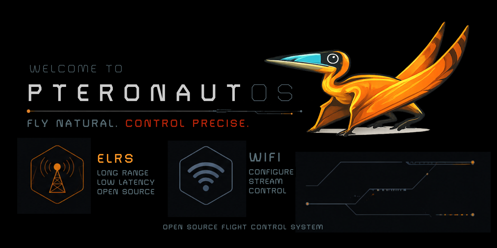
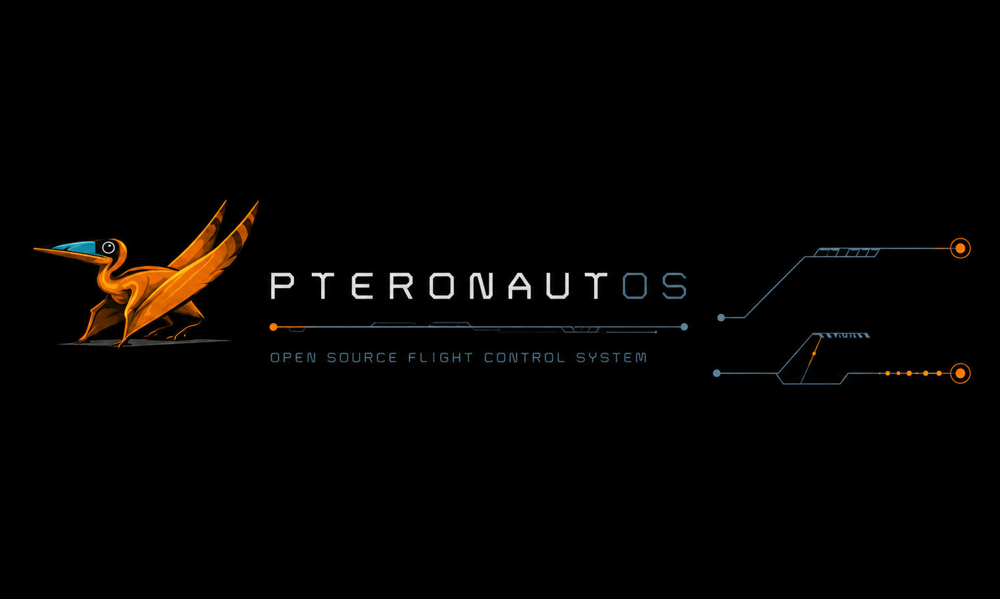

<p align="center"></p>

*Welcome, Pteronaut.*

**Open-source firmware for servo-driven ornithopters** — built on [ExpressLRS](https://github.com/ExpressLRS/ExpressLRS).

> 🌐 **[Documentation & Website](https://dantiel.github.io/PteronautOS/)** — [EN](https://dantiel.github.io/PteronautOS/en/) · [PT](https://dantiel.github.io/PteronautOS/)

PteronautOS replaces the traditional fixed-wing flight controller with an adaptive flapping oscillator built directly into the receiver. No intermediate FC required. The radio link directly drives the wings.

## Features

- **Adaptive Flapping Oscillator** — configurable waveform, amplitude, and frequency per channel
- **Automatic Gliding** — wings lock at neutral below throttle threshold (with hysteresis)
- **Zephyrus Gyro Stabilization** — MPU6050-based crest rudder correction for roll + yaw stability
- **Failsafe** — wings return to neutral on link loss, re-arm on reconnect
- **Direct PWM Output** — drives two wing servos + rudder + auxiliary channels
- **Minimal Footprint** — non-essential ELRS modules stripped (Telemetry, Baro, VTX, Thermal, Serial1)

## Build

```bash
pio run -e PteronautOS_ESP8285_2400_RX
```

### Current Footprint (ESP8285)

| Resource | Used | Free |
|---|---|---|
| RAM | 50,856 / 81,920 (62.1%) | 31,064 bytes |
| Flash | 553,272 / 991,216 (55.8%) | 437,944 bytes |

## Hardware

| Guide | Scope |
|-------|-------|
| [HARDWARE.md](HARDWARE.md) | Complete wiring guide — PWMP7 v1.1 pin mappings, GY-521 I²C wiring, voltage tables, servo compatibility, flash workflow |
| [ELRS PWM7 Reference](docs/en/hardware/elrs-pwm7-esp8285.md) | Generic ELRS PWM7 board specs and pin reference |

## Architecture

```
Radio Packet → ChannelData[16] → servosUpdate() (≈kHz tick)
                                      │
                    ┌─────────────────┼─────────────────┐
                    ▼                 ▼                  ▼
            zephyrusUpdate()  ornithopterUpdate()  servoCalcAllChannels()
           (gyro→AHRS→PID)    (flapping oscillator)  (standard PWM map)
                    │                 │
                    ▼                 ▼
           gyroRudderCorrection   servoLeftUs/servoRightUs
                    │                 │
                    └────┬────────────┘
                         ▼
                   servoRudderUs (pilot mix + gyro correction)
                         │
                         ▼
                   PWM Output (GPIOs)
```

### Ornithopter Module (`src/lib/Ornithopter/`)

| File | Lines | Purpose |
|---|---|---|
| `Ornithopter.h` | 57 | Core oscillator — state, timing, flapping/gliding logic |
| `Ornithopter.cpp` | 152 | Engine implementation — waveform generation, channel mixing |
| `OrnithopterConfig.h` | 54 | Compile-time defaults — channel mapping, servo limits, scaling |
| `OrnithopterWaveform.h` | 56 | Waveform library — sin, saw, square, custom shapes |
| `OrnithopterFilter.h` | 35 | Integration bridge — `#ifdef ORNITHOPTER_MODE` guards |

### Zephyrus Gyro Module (`src/lib/Zephyrus/`)

| File | Lines | Purpose |
|---|---|---|
| `ZephyrusConfig.h` | 54 | Compile-time constants — I²C, MPU6050, AHRS, PID, mixer gains |
| `Zephyrus.h` | 85 | Class declaration — MPU6050 driver, Mahony AHRS, dual PID |
| `Zephyrus.cpp` | 526 | Full implementation — sensor read, calibration, AHRS, PID, correction |
| `ZephyrusFilter.h` | 35 | Bridge shim — copies `rudderCorrection` → `ornithopter.gyroRudderCorrection` |

See [Zephyrus README](src/lib/Zephyrus/README.md) for full architecture, API, tuning guide, and troubleshooting.

### Integration Points in `devServoOutput.cpp`

| Line | Mechanism | Effect |
|---|---|---|
| 10 | `#include "Ornithopter/OrnithopterFilter.h"` + `"Zephyrus/ZephyrusFilter.h"` | Zero overhead without build flags |
| 158 | `ornithopterOnLinkDown()` + `zephyrusOnLinkDown()` in `servosEnterFailsafe()` | Wings to neutral, zero gyro on link loss |
| 230 | `zephyrusUpdate()` before `ornithopterUpdate()` in `servosUpdate()` | Gyro correction set before mixer runs |
| 357 | `ornithopterOnLinkUp()` + `zephyrusOnLinkUp()` in `event()` | Arms ornithopter, resets PID on connection |

### Stripped Modules in `rx_main.cpp`

All guarded with `#ifndef ORNITHOPTER_MODE`:
- AnalogVbat, Baro, VTxSPI, MSPVTx, Thermal
- Serial1, SerialUpdate
- Serial protocols (SBUS, CRSF serial via `OPT_CRSF_RCVR_NO_SERIAL`)

**Kept:** RF link, binding, PWM output, LED, WiFi config, Button, RX LUA.

## Configuration

Edit `src/lib/Ornithopter/OrnithopterConfig.h` to map your CRSF channels and tune flapping parameters:

- Wing servo PWM indices: `ORNITHOPTER_SERVO_LEFT` / `ORNITHOPTER_SERVO_RIGHT`
- 10 CRSF channel assignments: throttle, arm, cadence, ferocity, etc.
- Servo µs limits, flapping/gliding thresholds, amplitude scaling
- Steering differential, elevator/aileron scale, cadence rating

For gyro tuning, edit `src/lib/Zephyrus/ZephyrusConfig.h` — see the [Zephyrus README](src/lib/Zephyrus/README.md).

## Credits

Built on [ExpressLRS](https://github.com/ExpressLRS/ExpressLRS). Ornithopter module ported from [GralhaAzul v1.29.0](https://github.com/dantiel/o-grande-codigo-da-gralha-azul).
Zephyrus Gyro Module written from scratch for PteronautOS — MPU6050 register-level driver, Mahony AHRS, and dual PID with anti-windup.

<p align="center"></p>