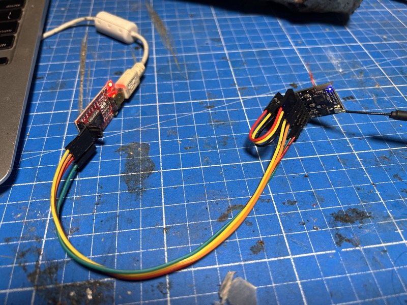

# ELRS PWM7 Receiver — PteronautOS Compatibility Guide

> *Hardware reference for the Generic 2400 PWMP7 (DIY_2400_RX_PWMPEX) ESP8285 receiver running PteronautOS with Zephyrus MPU6050 gyro stabilization.*

---

## 1. Overview

The **PWM7** is a DIY ESP8285-based ExpressLRS receiver using the SX1280 2.4GHz radio. It provides **7 PWM outputs** on a compact PCB, making it the recommended base hardware for servo-driven ornithopters running PteronautOS.

This guide covers pin mapping, I2C gyro integration, build configuration, and cross-flash procedure from stock ELRS 3.x firmware.

| Property | Value |
|---|---|
| **MCU** | ESP8285 @ 80MHz, 1MB Flash |
| **Radio** | SX1280 (2.4GHz) |
| **PWM Outputs** | 7 native → **6 usable** with Zephyrus gyro |
| **PteronautOS Target** | `PteronautOS_ESP8285_2400_RX` |
| **Legacy ELRS Target** | `DIY_2400_RX_PWMPEX` |
| **Hardware JSON** | `src/hardware/RX/Generic 2400 PWMP7.json` |
| **First Install** | ⚠️ UART only — Wi-Fi blocked (see §6) |

---

## 2. Full GPIO Pin Map

| GPIO | PWMP7 Function | PteronautOS Role | Conflict? |
|---|---|---|---|
| **0** | PWM Ch1 + Button | PWM Ch1 + Button | ✅ Shared OK |
| **1** | PWM Ch2 + UART TX | PWM Ch2 + Serial TX | ✅ Shared OK |
| **2** | PWM Ch7 | PWM Ch6 | ✅ Free |
| **3** | PWM Ch3 + UART RX | PWM Ch3 + Serial RX | ✅ Shared OK |
| **4** | **SX1280 DIO1** (IRQ) | **SX1280 DIO1** | 🔒 Hard-reserved (radio) |
| **5** | ~~PWM Ch6~~ | **I2C SDA** (MPU6050) | ⚡ Repurposed |
| **9** | PWM Ch4 | PWM Ch4 | ✅ Free |
| **10** | PWM Ch5 | PWM Ch5 | ✅ Free |
| **12** | SPI MISO | SPI MISO | 🔒 Radio bus |
| **13** | SPI MOSI | SPI MOSI | 🔒 Radio bus |
| **14** | SPI SCK | SPI SCK | 🔒 Radio bus |
| **15** | SPI NSS | SPI NSS | 🔒 Radio bus |
| **16** | ~~LED~~ | **I2C SCL** (MPU6050) | ⚡ Repurposed |
| **17** | VBAT ADC | VBAT ADC | ✅ Free |

---

## 3. MPU6050 I2C Pin Resolution

### The Conflict

The PWMP7 has **no dedicated I2C header**. The default Zephyrus I2C pins (GPIO4=SDA, GPIO5=SCL) conflict directly with:

- **GPIO 4** → SX1280 DIO1 (radio busy interrupt — **non-negotiable**)
- **GPIO 5** → PWM Channel 6 (output — sacrificial)

### The Resolution

| Signal | GPIO | Original Function | Status |
|---|---|---|---|
| **I2C SDA** | GPIO 5 | PWM Ch6 | Repurposed (PWM lost) |
| **I2C SCL** | GPIO 16 | LED | Repurposed (LED lost) |

**Cost:** 7 → 6 PWM outputs, no onboard LED. Both are acceptable tradeoffs for gyro stabilization.

### Wiring the MPU6050 (GY-521)

```
GY-521          PWMP7 Receiver
------          --------------
VCC  ─────────  3.3V
GND  ─────────  GND
SDA  ─────────  GPIO 5  (PWM Ch6 pad)
SCL  ─────────  GPIO 16 (LED pad)
```

> ⚠️ **Verify your PCB**: The GPIO 5 and GPIO 16 pads must be physically accessible on your specific PWMP7 board. Some PCB layouts route GPIO 16 only to the LED and may not expose it as a solder pad.

---

## 4. PWM Output Channels (Post-Zephyrus)

After I2C pin reassignment, **6 PWM outputs** remain:

| Logical Channel | GPIO | Original | Usage |
|---|---|---|---|
| **Ch1** | 0 | PWM1 | Left wing servo |
| **Ch2** | 1 | PWM2 | Right wing servo |
| **Ch3** | 3 | PWM3 | Crest rudder servo |
| Ch4 | 9 | PWM4 | Aux / spare |
| Ch5 | 10 | PWM5 | Aux / spare |
| Ch6 | 2 | PWM7 | Aux / spare |

> With 3 servos for the ornithopter (L-wing, R-wing, crest rudder), there are still 3 spare PWM channels. The 2:1 overhead ratio satisfies the hermetic mandate of grace in redundancy.

---

## 5. Build Configuration

### Build Flags (pteronautos-rx.ini)

```ini
[env_common_pteronautos_rx]
extends = env_common_8285rx, radio_SX128X
build_flags =
    -D ORNITHOPTER_MODE=1
    -D PTERONAUTOS=1
    -D ZEPHYRUS_ENABLED=1
    -D ZEPHYR_I2C_SDA=5
    -D ZEPHYR_I2C_SCL=16
    -include target/Unified_ESP_RX.h
    -Ilib/Ornithopter
    -Ilib/Zephyrus
```

The `-D ZEPHYR_I2C_SDA=5` and `-D ZEPHYR_I2C_SCL=16` flags override the default I2C pins (GPIO4/5) defined in `ZephyrusConfig.h`. The `#ifndef` guards in that header ensure these build-time overrides take precedence.

### Compile

```bash
cd src
pio run -e PteronautOS_ESP8285_2400_RX
```

**Build stats (as of latest):**

| Resource | Usage | Limit | % |
|---|---|---|---|
| **RAM** | 50,864 bytes | 81,920 bytes | 62.1% |
| **Flash** | 553,352 bytes | 991,216 bytes | 55.8% |

---

## 6. Flashing

### ⚠️ First Install: UART Required

**Wi-Fi first-install from factory ExpressLRS 3.x will fail with `ERROR[4]: Not Enough Space`.** This is a fundamental ESP8266 limitation, not a bug:

- The ESP8266 `Updater` class requires **both** old and new firmware to coexist in flash during the update
- PteronautOS firmware (≈557KB) + stock ELRS 3.2.0 (≈480KB) = 1,037KB → exceeds the 995KB sketch partition
- UART flashing erases the entire chip first, so no space conflict occurs

**After the initial UART flash, all subsequent updates work via Wi-Fi** — PteronautOS-to-PteronautOS fits within the partition.

#### UART Flashing Procedure

**What you need:**
- USB-to-UART adapter with **3.3V logic** (CP2102, CH340G, FT232, etc.)
- **Do not use 5V** adapters — ESP8285 GPIO is not 5V-tolerant

**Wiring:**

```
USB-UART          PWMP7 Receiver
--------          --------------
TX     ─────────  RX  (GPIO3)
RX     ─────────  TX  (GPIO1)
GND    ─────────  GND
                  3.3V ← power separately
```



> ⚠️ **Power the receiver from its own 5V supply**

**Enter bootloader mode:**
1. Hold the **button** (GPIO0 to GND)
2. Power on the receiver
3. Release the button after 1–2 seconds
4. The LED (if still present) may glow dimly or stay off — this is normal

**Flash with PlatformIO:**

```bash
cd src
pio run -e PteronautOS_ESP8285_2400_RX -t upload --upload-port /dev/cu.usbserial-XXXX
```

**Or flash with esptool.py:**

```bash
esptool.py --chip esp8266 --port /dev/cu.usbserial-XXXX --baud 460800 \
  write_flash 0x0 .pio/build/PteronautOS_ESP8285_2400_RX/firmware.bin
```

**Port examples by OS:**

| OS | Port Pattern |
|----|-------------|
| macOS | `/dev/cu.usbserial-*` or `/dev/cu.SLAB_USBtoUART` |
| Linux | `/dev/ttyUSB0` |
| Windows | `COM3` (check Device Manager → Ports) |

> 💡 **Save your firmware.bin** to a safe location before cleaning the build directory — PlatformIO's `pio run -t clean` will delete it.

### Method 2: WiFi Updates (Subsequent Only)

Once PteronautOS is installed via UART, Wi-Fi updates work normally:

1. Power the receiver; it enters WiFi AP mode if no transmitter is connected
2. Connect to `ExpressLRS RX` WiFi network (password: `expresslrs`)
3. Navigate to `http://10.0.0.1`
4. Upload `firmware.bin` from `.pio/build/PteronautOS_ESP8285_2400_RX/`

> ✅ **Verified working** on the PWMP7. All PteronautOS-to-PteronautOS updates succeed via Wi-Fi.

### Cross-Flash from ELRS 3.x

If the receiver currently runs ExpressLRS (DIY_2400_RX_PWMPEX), flashing PteronautOS will trigger an EEPROM reset due to `flash_discriminator` mismatch. All configuration will reset to defaults — this is **correct and expected behavior**.

**Remember:** cross-flash must be done via UART. Wi-Fi cross-flash from ELRS 3.x → PteronautOS fails with `ERROR[4]: Not Enough Space` due to flash partition constraints described above.

---

## 7. Web UI Configuration

After flashing, connect to the receiver's WiFi AP and navigate to `http://10.0.0.1`. The web UI retains full ELRS compatibility:

- **PWM Output Modes**: Configure each channel (50Hz, 100Hz, 160Hz, On/Off, etc.)
- **Channel 5 (GPIO5) and Channel 7 (GPIO16)**: Will appear as `Serial SCL` / `Serial SDA` respectively — Zephyrus I2C pins are automatically excluded from PWM
- **Binding Phrase**: Set from web UI or via Lua script
- **Model Match**: Full support retained

---

## 8. SX1280 Radio

| Signal | GPIO | Notes |
|---|---|---|
| **NSS** | 15 | SPI chip select |
| **SCK** | 14 | SPI clock |
| **MOSI** | 13 | SPI data out |
| **MISO** | 12 | SPI data in |
| **BUSY/DIO1** | 4 | **Hard-reserved** — do not repurpose |
| **RST** | — | Shared with ESP8285 reset |

The SX1280 DIO1 (GPIO4) is used for TX_DONE/RX_DONE interrupts — essential for packet timing. It is **not available** for any other function.

---

## 9. LED & Button

| Function | GPIO | Status with Zephyrus |
|---|---|---|
| **LED** | ~~16~~ | ❌ Repurposed for I2C SCL |
| **Button** | 0 | ✅ Functional (shared with PWM Ch1) |

With the LED pin repurposed for I2C, the receiver has **no visual status indicator** during operation. Use the web UI or Lua script telemetry for link status. The button on GPIO0 remains functional for binding and WiFi mode entry.

---

## 10. VBAT / Voltage Monitoring

| Parameter | Value |
|---|---|
| **ADC Pin** | GPIO 17 (TOUT) |
| **Scale** | 310 |
| **Offset** | 12 |
| **Calibration Range** | 3.5V – 25.2V |

VBAT monitoring is retained from the stock ELRS configuration. The analog divider network on the PWMP7 PCB remains unchanged.

---

## 11. PWM Safety Guards

PteronautOS implements three layers of I2C pin protection:

| Layer | Mechanism | Location |
|---|---|---|
| **Compile-time** | `#ifndef` guards on I2C pin defines | `ZephyrusConfig.h` |
| **PWM init** | Hardware exclusion of I2C pins from PWM | `devServoOutput.cpp` |
| **Config defaults** | I2C pins default to `somSCL`/`somSDA` mode | `config.cpp` |

These guards ensure that even if the web UI configuration is accidentally changed, the I2C pins will never be driven as PWM outputs — preventing electrical contention with the MPU6050.

---

## 12. Failsafe Behavior

| Condition | Servo Response |
|---|---|
| **Link lost** | All PWM channels center to 1500µs |
| **MPU6050 failure** | Zephyrus disengages — rudder stays neutral |
| **I2C bus hang** | Timeout + decay — Zephyrus self-deactivates |
| **EEPROM corruption** | Defaults loaded — safe centering |

All failsafe paths respect the hermetic principle: *the wings center, the rudder centers, the craft glides.*

---

## 13. Known Limitations

| Issue | Impact | Mitigation |
|---|---|---|
| **No onboard LED** | No visual link status | Use CRSF telemetry / Lua script |
| **GPIO 5 & 16 must be accessible** | Some PCB revisions may not expose pads | Verify before soldering |
| **No I2C pull-up resistors** | May need external 4.7kΩ pull-ups on SDA/SCL | Add to GY-521 breakout |
| **62% RAM usage** | Limited headroom for future features | Stay within hermetic 65% limit |
| **Single UART** | Cannot use both serial RX and debug simultaneously | Disable debug for PWM3 serial use |
| **Wi-Fi first-install blocked** | `ERROR[4]: Not Enough Space` when cross-flashing from ELRS 3.x via Wi-Fi | Use UART for first install; all subsequent updates via Wi-Fi work |

---

## 14. Reference: Stock PWMP7 Hardware JSON

```json
{
    "radio_dio1": 4,
    "radio_miso": 12,
    "radio_mosi": 13,
    "radio_nss": 15,
    "radio_sck": 14,
    "power_min": 0,
    "power_high": 0,
    "power_max": 0,
    "power_default": 0,
    "power_control": 0,
    "power_values": [13],
    "power_lna_gain": 0,
    "led": 16,
    "pwm_outputs": [0, 1, 3, 9, 10, 5, 2],
    "vbat": 17,
    "vbat_offset": 12,
    "vbat_scale": 310,
    "vbat_cal_min": 3500,
    "vbat_cal_max": 25200
}
```

This configuration is preserved unchanged. The I2C pin reassignment happens at the **firmware level** via build flags — the hardware JSON remains stock ELRS for upstream compatibility.

---

*PteronautOS — Fly Natural. Control Precise.*